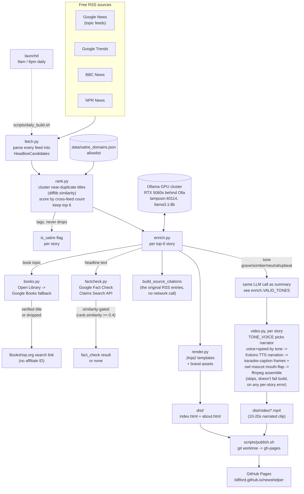

# NewsHelper

Beyond-the-headline daily news digest. A static site that surfaces the day's
top 6 stories (by cross-feed frequency across free RSS sources) with an
AI-generated plain-language summary of each, plus a verified list of
deeper-reading follow-ups — including books, which most aggregators skip.

**Live:** https://billford.github.io/newshelper/

See [ADR-001](docs/adr/ADR-001-newshelper.md) (v1) and
[ADR-002](docs/adr/ADR-002-cron-and-misinformation-v2.md) (v2) for the full
design rationale.

## Pipeline



1. **Fetch** — pull candidates from Google News, Google Trends, BBC, NPR RSS feeds.
2. **Rank** — cluster near-duplicate titles across feeds, score by source count, keep top 6; tag known satire/parody domains (`data/satire_domains.json`) without dropping them. Plain code, not model-based.
3. **Enrich** — ask a local model (Ollama, on a small GPU cluster — two RTX 5060 16GB boxes behind [Olla](https://github.com/thushan/olla) as an Ollama-compatible load balancer, `lampoon.billford.io:40114`) for a summary and book/article topic ideas per story, then verify every book suggestion against Open Library (fallback: Google Books) before it's allowed to be published. The reader-facing book link is a plain Bookshop.org search, not an affiliate link. Also cites the original RSS articles the summary was built from ("SOURCE" go-deeper links), and looks up a grounded fact-check via Google's Fact Check Claims Search API (`factcheck.py`) — independent of satire tagging, never asserts its own truth verdict, just surfaces a real published rating with a link.

   The GPU cluster is shared with other jobs on the LAN, so enrichment is
   written to survive a busy one. `ollama_client.py` retries a 429/5xx or a
   dropped connection (`OLLAMA_MAX_ATTEMPTS`, widening backoff), and a story
   whose call still fails is kept — with its real source citations and
   fact-check, minus the summary — rather than killing the build, the same
   log-and-skip posture `video.py` takes. The one exception is *every* story
   failing: that means the backend is down, so `enrich_all` raises
   `EnrichmentUnavailable` and the build aborts **before** publishing, which
   leaves the last good digest up instead of overwriting it with six empty
   stories.
4. **Video** (`video.py`) — per story, narrate the title + full summary with local Kokoro TTS, render karaoke-style word-highlight captions over a branded card with the NewsHelper owl mascot animated in a bottom-left inset (amplitude-driven mouth flap, not real lip-sync — see `mascot.py`), then assemble with `ffmpeg` into a 10-20s `.mp4`. Narration voice and pace are chosen by the story's `tone` (`grave`/`somber`/`neutral`/`upbeat`, classified by the same enrichment LLM call that writes the summary — see `config.TONE_VOICE`), so a mass-casualty story isn't read in the same bright voice as a human-interest piece. A per-story failure is logged and skipped, not fatal to the build. Requires `ffmpeg` on `PATH` — see Scheduling below for why that's not a given under launchd.
5. **Render** — write a static `dist/index.html` and `dist/about.html` (old-newspaper editorial style, brand assets in `static/brand/`, no client-side JS). Every story — lead and "also today" — gets the same summary + go-deeper treatment, laid out as a 2-column grid, with its video embedded when generation succeeded.

## Scheduling

Builds twice daily (9 AM / 6 PM) via launchd, not cron — the build machine
runs macOS. `scripts/daily_build.sh` runs the build then `scripts/publish.sh`,
logging to `logs/daily_build.log` (gitignored) and firing a macOS
notification on failure. The LaunchAgent definition is
`scripts/com.billford.newshelper.daily.plist`, installed to
`~/Library/LaunchAgents/` and loaded with `launchctl bootstrap` (or
`launchctl load` on older syntax).

launchd runs jobs with a bare `PATH=/usr/bin:/bin:/usr/sbin:/sbin` — it does
not inherit your shell's PATH. `daily_build.sh` explicitly prepends
`/opt/homebrew/bin` so Homebrew's `ffmpeg` (required for video generation,
see the pipeline above) resolves; a build run outside this script (e.g. a
bare `python -m newshelper.build` in a minimal environment) will silently
skip every video with a `FileNotFoundError` if `ffmpeg` isn't already on
PATH. The installed plist's `EnvironmentVariables` also pins
`NEWSHELPER_OLLAMA_HOST`/`NEWSHELPER_OLLAMA_MODEL` to the GPU cluster, and
`config.py` now defaults to the same cluster even without that override —
see "Running locally" for why that default exists.

**Fact-check lookups need a Google Cloud API key** (Fact Check Tools API
enabled) set as `NEWSHELPER_FACTCHECK_API_KEY` in wanderlust's local
environment — not yet provisioned, so this is currently a correctly-behaving
no-op rather than a broken feature. See ADR-002.

## Running locally

```bash
python -m venv .venv && source .venv/bin/activate
pip install -r requirements-dev.txt
PYTHONPATH=src python -m pytest
```

To run a full build (requires `ffmpeg` on PATH for video generation, and
either network access to the GPU cluster or a local Ollama instance):

```bash
PYTHONPATH=src python -m newshelper.build
```

`config.py` defaults `NEWSHELPER_OLLAMA_HOST`/`NEWSHELPER_OLLAMA_MODEL` to
the GPU cluster (`lampoon.billford.io:40114` via Olla, `llama3.1:8b`) so a
plain local run still hits the intended backend instead of silently falling
back to whatever Ollama happens to be running on your machine. To point at
a different model or a local Ollama instance instead, override both env
vars, e.g.:

```bash
NEWSHELPER_OLLAMA_HOST=http://localhost:11434 \
NEWSHELPER_OLLAMA_MODEL=qwen2.5:32b \
PYTHONPATH=src python -m newshelper.build
```

Output lands in `dist/`, including `dist/video/*.mp4` — `daily_build.sh`
deletes the local copies after a successful publish since they're already
pushed to `gh-pages` by then.

## Publishing

`scripts/publish.sh` pushes `dist/` to the `gh-pages` branch from wherever
it's run, using a local worktree. GitHub Pages is already configured to
serve from that branch.

## Status

**v1 shipped 2026-07-21** — live end-to-end on real RSS data, real local-model
enrichment, and a real published page.

**v2 shipped 2026-07-21** — twice-daily launchd automation, grounded
fact-check tagging (`factcheck.py`, pending an API key to go live), and
source-citation links on every story. See ADR-002's Action Items for what's
left: provisioning the Fact Check Tools API key, and confirming the
launchd schedule holds up over the first several real days.

**v3 shipped 2026-07-24** — local, narrated 10-20s video summary per story
(`video.py`), Kokoro TTS narration, karaoke-style captions, and the
NewsHelper owl mascot animated via mouth-flap (`mascot.py`), assembled with
`ffmpeg`. As of 2026-07-28, video generation is fixed end-to-end: launchd's
minimal PATH was hiding `ffmpeg` from every scheduled build (silently
skipping all videos since v3 shipped), and enrichment now defaults to the
GPU cluster (Olla-fronted RTX 5060s) instead of risking a silent fallback
to whatever Ollama happens to be on the build machine.
