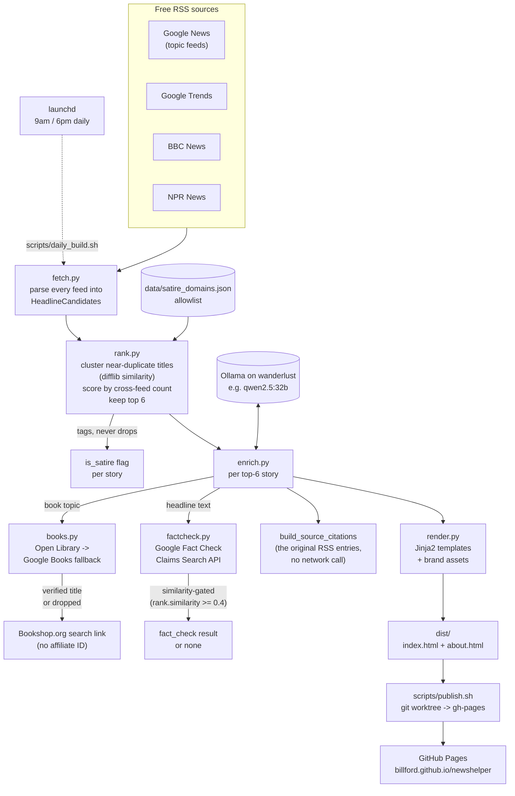

# NewsHelper

Beyond-the-headline daily news digest. A static site that surfaces the day's
top 6 stories (by cross-feed frequency across free RSS sources) with an
AI-generated plain-language summary of each, plus a verified list of
deeper-reading follow-ups — including books, which most aggregators skip.

**Live:** https://billford.github.io/newshelper/

See [ADR-001](docs/adr/ADR-001-newshelper.md) (v1) and
[ADR-002](docs/adr/ADR-002-cron-and-misinformation-v2.md) (v2) for the full
design rationale.

## Pipeline



1. **Fetch** — pull candidates from Google News, Google Trends, BBC, NPR RSS feeds.
2. **Rank** — cluster near-duplicate titles across feeds, score by source count, keep top 6; tag known satire/parody domains (`data/satire_domains.json`) without dropping them. Plain code, not model-based.
3. **Enrich** — ask a local model (Ollama, running on "wanderlust") for a summary and book/article topic ideas per story, then verify every book suggestion against Open Library (fallback: Google Books) before it's allowed to be published. The reader-facing book link is a plain Bookshop.org search, not an affiliate link. Also cites the original RSS articles the summary was built from ("SOURCE" go-deeper links), and looks up a grounded fact-check via Google's Fact Check Claims Search API (`factcheck.py`) — independent of satire tagging, never asserts its own truth verdict, just surfaces a real published rating with a link.
4. **Render** — write a static `dist/index.html` and `dist/about.html` (old-newspaper editorial style, brand assets in `static/brand/`, no client-side JS). Every story — lead and "also today" — gets the same summary + go-deeper treatment, laid out as a 2-column grid.

## Scheduling

Builds twice daily (9 AM / 6 PM) via launchd, not cron — wanderlust runs
macOS. `scripts/daily_build.sh` runs the build then `scripts/publish.sh`,
logging to `logs/daily_build.log` (gitignored) and firing a macOS
notification on failure. The LaunchAgent definition is
`scripts/com.billford.newshelper.daily.plist`, installed to
`~/Library/LaunchAgents/` and loaded with `launchctl load`.

**Fact-check lookups need a Google Cloud API key** (Fact Check Tools API
enabled) set as `NEWSHELPER_FACTCHECK_API_KEY` in wanderlust's local
environment — not yet provisioned, so this is currently a correctly-behaving
no-op rather than a broken feature. See ADR-002.

## Running locally

```bash
python -m venv .venv && source .venv/bin/activate
pip install -r requirements-dev.txt
PYTHONPATH=src python -m pytest
```

To run a full build (requires Ollama serving locally):

```bash
PYTHONPATH=src NEWSHELPER_OLLAMA_MODEL=qwen2.5:32b python -m newshelper.build
```

`config.py`'s documented default model is `llama3.1:8b`; in practice
`qwen2.5:32b` produced noticeably more accurate summaries in testing (the
smaller model hallucinated on a real story), so override it per-machine via
`NEWSHELPER_OLLAMA_MODEL` until the default is revisited. Output lands in
`dist/`.

## Publishing

`scripts/publish.sh` pushes `dist/` to the `gh-pages` branch from wherever
it's run, using a local worktree. GitHub Pages is already configured to
serve from that branch.

## Status

**v1 shipped 2026-07-21** — live end-to-end on real RSS data, real local-model
enrichment, and a real published page.

**v2 shipped 2026-07-21** — twice-daily launchd automation, grounded
fact-check tagging (`factcheck.py`, pending an API key to go live), and
source-citation links on every story. See ADR-002's Action Items for what's
left: provisioning the Fact Check Tools API key, and confirming the
launchd schedule holds up over the first several real days.
